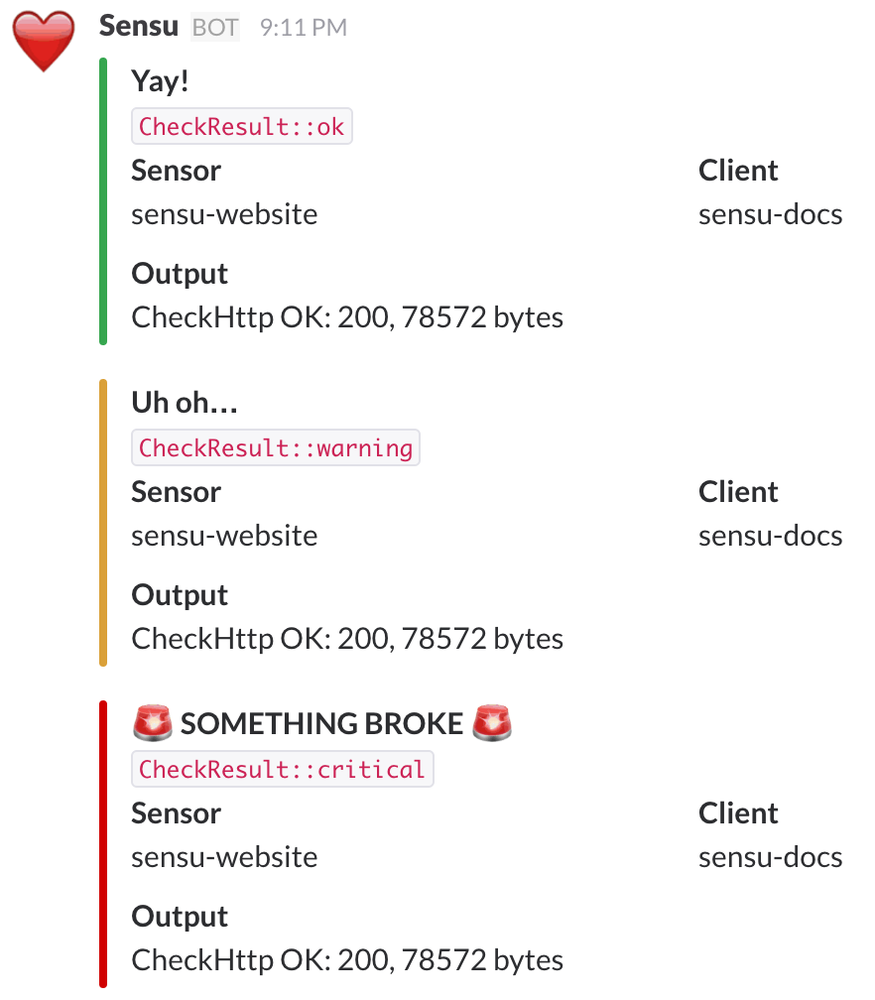

# Sensu Slack Handler
~~Phpandler?~~

## Setup

- `composer install`
- `cp .env.example .env`
- Add a valid webhook to `SLACK_WEBHOOK_URL` in `.env`
- Set up the handler on your sensu-server

## Usage

Pipe stuff to it like any other Sensu handler:

```sh
cat example.json | php handler.php
```

*NB* currently only handles a single line of input

The channel posted to can be overwritten by setting `check.channel` in a check's JSON:

```json
{
  "check": {
    "channel": "#some_channel"
  }
}
```


